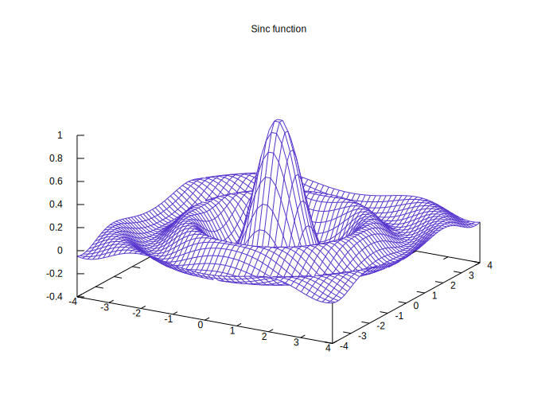

# Welcome to MkDocs Entangled Plugin
Using this plugin, you can make your Entangled documents look better.

## Install

Install this with `pip install mkdocs-entangled-plugin`. To use the entangled plugin, add the following lines to your `mkdocs.yml`:

```yaml
watch:
  - docs       # watch markdown sources
  - src        # add your src directories to watch

plugins:
  - entangled  # this also runs `entangled sync` as a pre-build action

markdown_extensions:
  - pymdownx.superfences
  - pymdownx.tabbed:
      alternate_style: true 
```

Also create `entangled.toml`, the `version` field is obligatory.

```toml
version = "2.0"
watch_list = ["docs/**/*.md"]
hooks = ["build"]
```

## Components
This plugin bundles functionality for literate programming with Entangled.

- Annotate code blocks with titles.
- Run entangled as part of `mkdocs serve` cycle

### Annotate code blocks
The default markdown syntax that Entangled supports has fenced code blocks as follows

~~~markdown
``` {.python file=examples/hello_world.py}
if __name__ == "__main__":
    <<hello-world>>
```
~~~

Which renders like this:

``` {.python file=examples/hello_world.py}
if __name__ == "__main__":
    <<hello-world>>
```

Or named code blocks

~~~markdown
``` {.python #hello-world}
print("Hello, World!")
```
~~~

that render like this:

``` {.python #hello-world}
print("Hello, World!")
```

### Build Artifacts

Build artifacts by specifying a Makefile.

~~~markdown
=== "Figure 1"

    

=== "Source"

    ``` {.gnuplot file=examples/plot.gp}
    # enter your plotting commands here
    ```

    ``` {.make #build target=docs/fig/plot.svg}
    docs/fig/plot.svg: examples/plot.gp
    > mkdir -p $(@D)
    > gnuplot $^ > $@
    ```
~~~

=== "Figure 1"

    

=== "Source"

    ``` {.gnuplot file=examples/plot.gp}
    set term svg background rgb 'white' size 700, 500
    sinc(r) = sin(pi*r) / (pi*r)
    set isosamples 50, 50
    set hidden3d
    set xrange [-4:4]
    set yrange [-4:4]
    set xyplane 0
    set title "Sinc function"
    splot sinc(sqrt(x**2 + y**2)) t'' lc rgb '#5533cc'
    ```

    ``` {.make #build target=docs/fig/plot.svg}
    docs/fig/plot.svg: examples/plot.gp
    > mkdir -p $(@D)
    > gnuplot $^ > $@
    ```

## License
Licensed under the Apache-2 license agreement: see LICENSE
